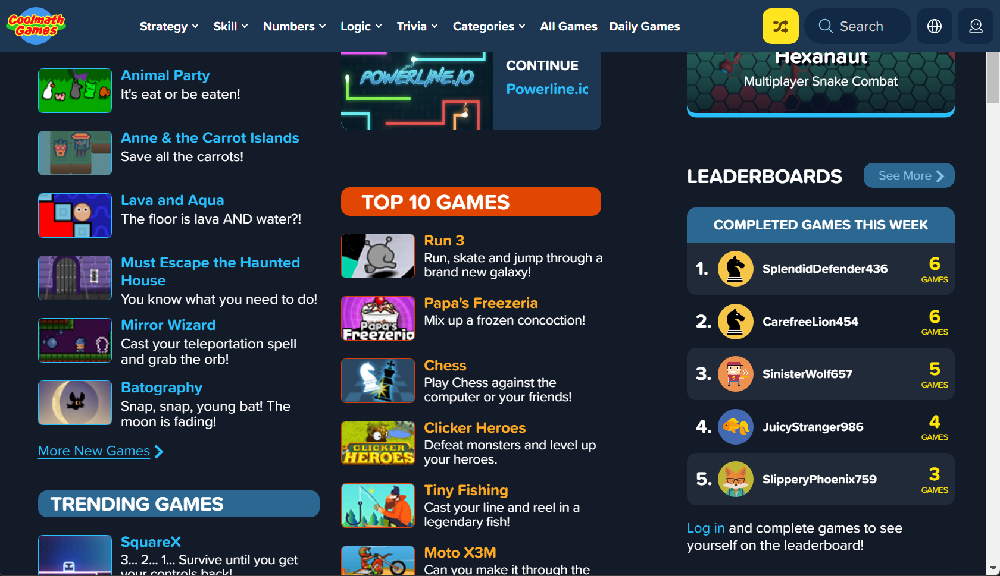
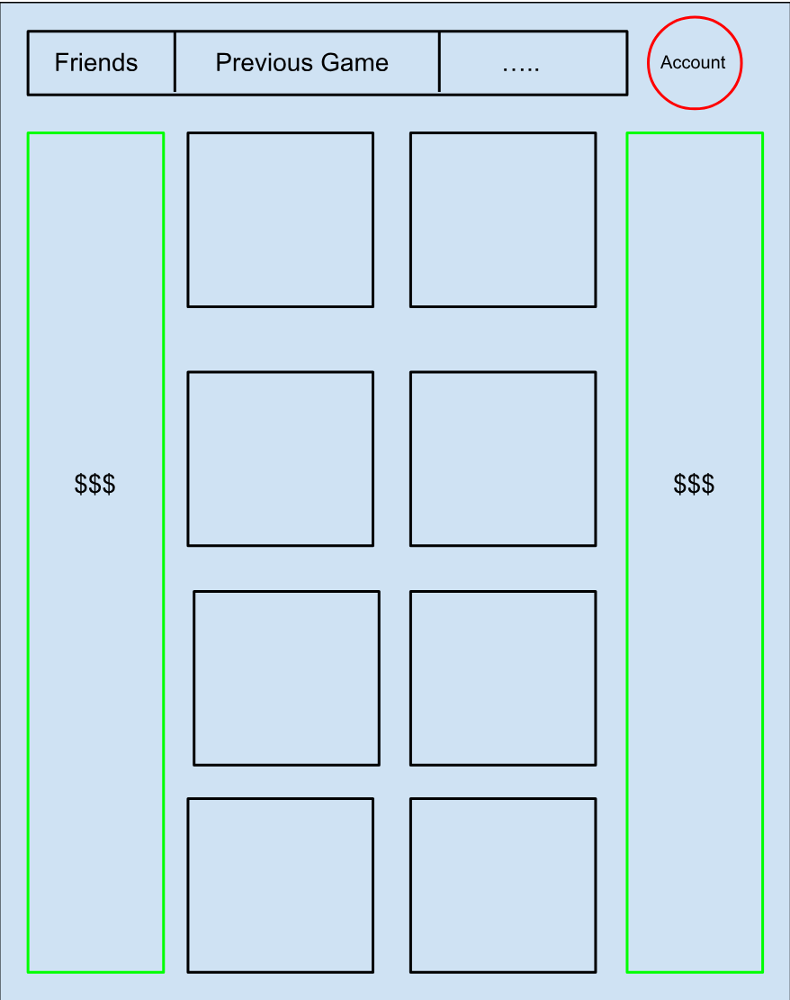

# GameDesign - ""

Conceptualizing, designing, and planning the development of a large-scale web or mobile application/game

## Introduction 🎮:

Even to this day classics like connect 4, tic-tac-toe, and pong are played as a quick and simple pass time either in between study sessions or even in class. "" aims to provide a refreshing take on classic games that provided entertainment to all of us in our previous years and presumably in our years to come. With the hopes of providing a new layer of depth to your favorite games, users will become more hooked than ever before.

- **Pong 2.0**

  - _Description:_ A modernized version of the classic Pong game with added features such as power-ups, leaderboards, and more.

- **Connect X**

  - _Description:_ A variation of the classic Connect Four game with an increased board size, a point system, and various power-ups to make it more challenging and exciting.

- **Reverse Tower Defense**

  - _Description:_ Invert the tower defense genre by allowing players to control waves of enemies and challenge them to defeat the player's defensive structures in creative and strategic ways.

- **Recursive Tic-Tac-Toe "Tic-Tac-2"**
  - _Description:_ A unique twist on Tic-Tac-Toe, where players play Tic-Tac-Toe games inside of other Tic-Tac-Toe games, creating a recursive and challenging experience.

## Value/Use 💡:

Similar to online game portals like ["Cool Math Games"](https://www.coolmathgames.com), "" will provide easy and simple access to a catalouge of revamped classic games only a click away. Furthermore, due to the nature of its design (being a web app), monetization through advertisements will be incredibly simple to implement all while not hindering the users experience with intersitial ads aka "full-screen ads".

## User Interaction and Experience:

Many of the games provided on the grid-like web page will be "single-session games", albeit updated, like "pong". This style of of games allows users to try out the web page's entire catalouge if they happened to exhaust a particular game. Furthermore, this level of accessibilty makes it the ideal webpage to visit if you only have a limited amount of free time with a buddy, want to quickly destress, or you're in the middle of class and want to look busy. If a game does play better with save states, the user can be prompted to register an account if they would like to return to the game. "" will strive towards simplicity within its gameplay and even user interface.

  <h1><a href="https://www.coolmathgames.com">🌟 Cool Math Games UI 🌟</a></h1>

---

  <h2>🚀 Potential "" UI 🚀</h2>

## Competitive Element 🏆:

With the option to play local multiplayer or even online multiplayer most, if not all, of the catalouge of games will incorporate some sort of competitive element to keep the user engaged. Additionally, unlike other online game portals, if a user is registered with "" a leaderboard of your friends list can display:

- total hours played
- total amount of wins accumulated
- friend count
- invite to game etc.

| Wins | User Name | Status                                              |
| ---- | :-------- | :-------------------------------------------------- |
| 3    | Friend 1  | ✔️ **Online**  |
| 5    | Friend 2  | Offline                                             |
| 0    | Friend 3  | Offline                                             |
| 1    | Friend 4  | Offline                                             |
| 4    | Friend 5  | ✔️ **Online** |
| 9    | Friend 6  | ✔️ **Online** |

## Engagement and Addictiveness Strategies 🔥:

Simple but engaging games elicit a sense of competitiveness not only with others but withing yourself as well. It's not uncommon to become hooked on a game because you want beat your previous highscore.

## Scalability and Expansion 🌱:

"" will start off with a few classic and simple games to populate the website. As the activity on the page grows, it will be incredibly easy to add any new game to the already simple user interface. Additionally, like discussed previously, the web page can easily become monetized without inhibiting the user experience.

## Accessibility and Inclusivity 🌍:

All characters in-game are fictional and will not be based on anything in the real world.
